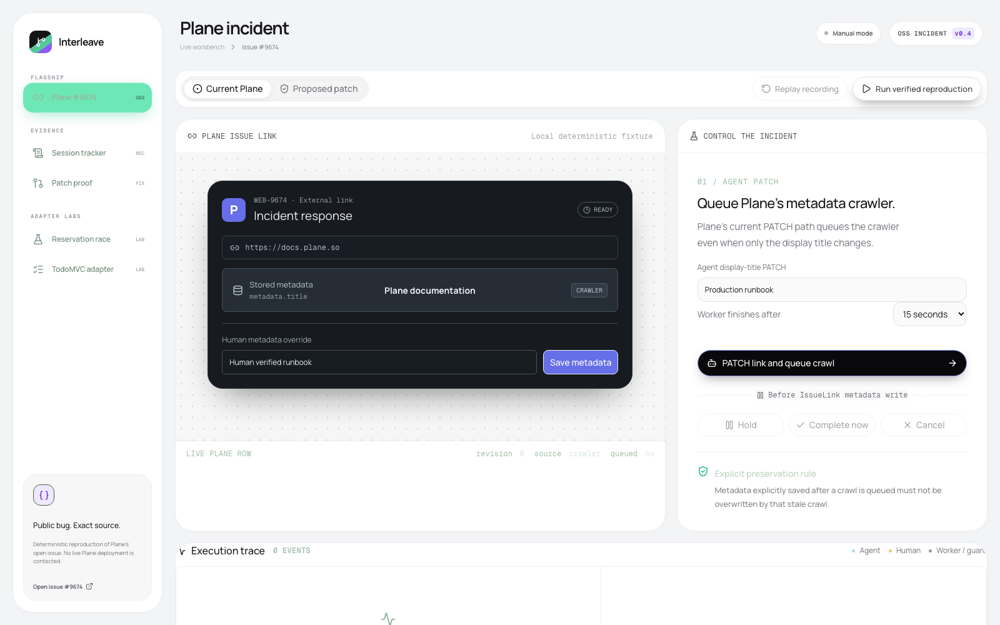
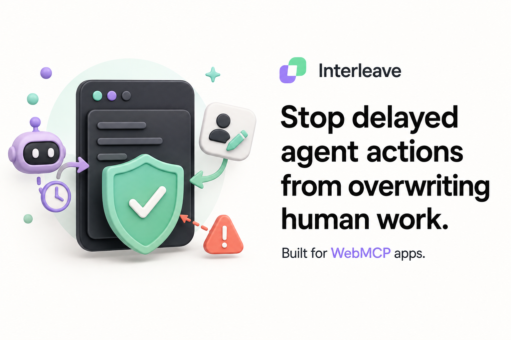
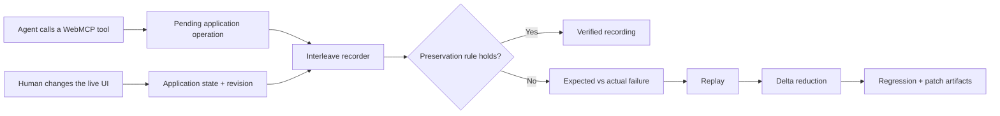

<div align="center">



<br />


### The agent calls the app. The human keeps editing. Interleave proves what happened between.

Interleave is a concurrency assurance layer for WebMCP applications. It records real pending tool calls beside meaningful human actions and application state changes, then identifies the exact moment a delayed operation violates an explicit product rule.

When a failure appears, Interleave replays the same recording, reduces it to the smallest reliable sequence, and exports a deterministic regression test. Its flagship Plane integration takes a documented open-source race from public issue [makeplane/plane#9674](https://github.com/makeplane/plane/issues/9674) all the way from witnessed failure to a tested upstream patch.

<p>
  <a href="https://interleave-iota.vercel.app"><strong>Live app</strong></a>
  ·
  <a href="#judge-interleave-in-90-seconds"><strong>Judge in 90 seconds</strong></a>
  ·
  <a href="#demo"><strong>Demo</strong></a>
  ·
  <a href="#how-interleave-decides"><strong>How it decides</strong></a>
  ·
  <a href="https://interleave-iota.vercel.app/integrate"><strong>Integrate the recorder</strong></a>
</p>

</div>

---

<a id="demo"></a>

## ▶ Demo

<div align="center">

<a href="https://youtu.be/9EWZyxjHgj0">
  
</a>

<p>
  <strong><a href="https://youtu.be/9EWZyxjHgj0">Watch the public demo ↗</a></strong>
  ·
  <strong><a href="https://interleave-iota.vercel.app/plane">Run the live Plane demo ↗</a></strong>
</p>

</div>

The flagship demo starts a real pending WebMCP call, lets a person save newer metadata while that call is unresolved, and then allows the delayed worker to finish. Interleave captures all three moments and shows the rule, expected title, actual title, queued revision, and live revision that prove the stale write.

The visible result is produced by the running application. It is not a reconstructed log or a precomputed animation.

```text
One pending agent call. One human edit. One stale completion.
Record it. Minimize it. Turn it into a regression.
```

---

## Judge Interleave in 90 seconds

Open the **[live Plane workbench](https://interleave-iota.vercel.app/plane)** in a browser with WebMCP support.

1. Click **Run verified reproduction**.
2. Watch the delayed crawler overwrite `Human verified runbook` with `Plane documentation`.
3. Open **Session tracker** to inspect the agent call, human edit, worker completion, and exact violated rule on one timeline.
4. Return to the incident and select **Proposed patch**. Replay the same recording to see the revision guard preserve the human value.
5. Open **Patch proof** to inspect the minimized sequence, deterministic regression, proposed Plane patch, source pin, and validation record.

| 9 native tools | 3 required commands | 50 / 50 project tests | 37 / 37 Plane patch tests |
| ---: | ---: | ---: | ---: |
| idle Plane surface | minimized failure | release gate | affected upstream modules |

To run the same flow locally:

```sh
git clone https://github.com/Pavilion-devs/interleave.git
cd interleave
npm install
npm run dev
```

Then open `http://localhost:3000/plane`. Run the complete release gate with:

```sh
npm run check
```

The production evidence is split into three focused views:

- [`/plane`](https://interleave-iota.vercel.app/plane) — reproduce the race and compare current behavior with the guard.
- [`/plane/tracker`](https://interleave-iota.vercel.app/plane/tracker) — inspect recordings, receipts, state transitions, and verdicts.
- [`/plane/proof`](https://interleave-iota.vercel.app/plane/proof) — replay, reduce, export the regression, and review the upstream patch.

---

## Table of contents

- [The problem I set out to solve](#the-problem-i-set-out-to-solve)
- [What I built](#what-i-built)
- [Architecture](#architecture)
- [How Interleave decides](#how-interleave-decides)
- [The WebMCP contract](#the-webmcp-contract)
- [Engineering decisions & the hard problems](#engineering-decisions--the-hard-problems)
- [Use it in any repo](#use-it-in-any-repo)
- [The live workbench](#the-live-workbench)
- [Honesty: limitations](#honesty-limitations)
- [Tech stack](#tech-stack)
- [Project layout](#project-layout)
- [Run it locally](#run-it-locally)
- [Tests](#tests)
- [Attribution](#attribution)
- [License](#license)

---

## The problem I set out to solve

WebMCP lets an agent call a website through structured tools while a person continues using the same interface. That creates a new class of race:

```text
The agent reads state A and starts slow work.
The human changes A to B while that work is pending.
The delayed operation finishes with an answer based on A.
The application silently replaces B.
```

The call can report success. The interface can look healthy. Ordinary request logs can contain every expected response. The user still loses the newer change because no single observer connected the agent call, human action, state revisions, and final write.

This is an application correctness problem. Different products need different rules, but they need the same evidence: what was read, what changed, what completed, and whether the final state still respected the product's invariant.

Interleave makes that interleaving visible and reusable as a test.

---

## What I built

Interleave has three connected parts.

### 1. A live concurrency workbench

The workbench runs actual asynchronous application operations. A call remains pending while the person uses the visible interface. Interleave records tool arguments, results, errors, cancellation, semantic human actions, timestamps, and selected before/after state.

Three application models demonstrate the approach:

- **Plane #9674** — a source-verified metadata overwrite based on Plane's public issue and pinned source.
- **Reservation race** — a delayed reservation commits an earlier ticket quantity after the person changes it.
- **TodoMVC adapter** — a delayed clear computes against an old list while the person adds another todo.

### 2. A reusable recorder

[`@interleave/recorder`](packages/recorder) is dependency-free and framework-independent. It wraps application tool functions and explicit human state transitions without inspecting another site, patching the browser, or reading hidden model reasoning.

### 3. A complete contribution path

The Plane lab turns one witnessed race into:

- a rule violation with expected and actual values;
- a replay against current and proposed behavior;
- a three-command minimized reproduction;
- a deterministic regression test;
- a proposed compare-and-set patch for Plane; and
- a 37-test validation record for the two affected upstream modules.

The patch is pinned to Plane commit [`da1a7ab85012d16836459a10dd92ec55eb739c69`](https://github.com/makeplane/plane/commit/da1a7ab85012d16836459a10dd92ec55eb739c69). The fixture uses public source and local deterministic state; it contacts no Plane deployment, account, or user data.

---

## Architecture



The recorder observes boundaries the application already owns. Each adapter defines the meaningful state, human actions, replay operations, and correctness rule for its product.

| Part | Role |
| --- | --- |
| [`packages/recorder`](packages/recorder) | Generic call and state-transition recording, immutable snapshots, redaction hooks, interruption handling, and bounded history. |
| [`lib/plane`](lib/plane) | Plane state model, delayed crawler, invariant, replay, reduction, regression export, and WebMCP tools. |
| [`lib/todomvc`](lib/todomvc) | Independent TodoMVC reducer adapter and seeded stale-state orchestration. |
| [`app`](app) | Live workbench, session trackers, patch proof, integration guide, and manual fallback controls. |
| [`tests`](tests) | Recorder contracts, race behavior, WebMCP surface checks, replay, reduction, and exports. |
| [`public`](public) | Browser acceptance receipt, regression, recorder package, screenshot, and Plane patch. |

---

## How Interleave decides

Interleave does not guess whether a state change is correct. The integrating application declares an explicit invariant and supplies the state needed to evaluate it.

For Plane, the rule is:

> Metadata explicitly saved after a crawl is queued must not be overwritten by that stale crawl.

The evaluation follows a concrete sequence:

1. Snapshot the relevant application state before the tool starts.
2. Keep the tool receipt pending while its real promise is unresolved.
3. Record semantic human actions and the state revision they create.
4. Record the eventual worker result and final application state.
5. Evaluate the adapter's rule with the full ordered trace.
6. Show the expected value beside the actual value at the violating event.
7. Replay the recording against current and guarded implementations.
8. Remove commands one at a time until only the smallest failing sequence remains.

For the Plane incident, the minimized recipe is:

```text
start_crawl → edit_metadata → release
```

| Observed state | Decision |
| --- | --- |
| No newer metadata revision exists | The worker may apply its result. |
| A newer human revision exists and the worker writes anyway | The preservation rule fails. |
| A newer human revision exists and the guard refuses the write | The human value is preserved. |
| The operation is cancelled | No worker write is committed. |
| A recording is truncated, unfinished, or uses an unknown adapter/action | Reliable replay is refused. |

---

## The WebMCP contract

Interleave uses native `document.modelContext.registerTool`. There is no WebMCP polyfill and no simulated agent transcript.

The Plane adapter exposes nine focused tools while idle:

| Tool | Purpose |
| --- | --- |
| `plane_read_context` | Read compact incident state, available actions, and current evidence. |
| `plane_reset` | Reset the deterministic fixture and choose current or proposed behavior. |
| `plane_patch_link_slow` | Start the actual pending issue-link update and crawler promise. |
| `plane_replay` | Replay a saved recording through asynchronous checkpoints. |
| `plane_compare_modes` | Run the same recording against current Plane and the proposed guard. |
| `plane_reduce_failure` | Find the smallest command sequence that retains the violation. |
| `plane_export_regression` | Produce the deterministic regression artifact and receipt. |
| `plane_export_upstream_patch` | Produce the pinned Plane patch and validation receipt. |
| `plane_list_sessions` | List browser-local recordings without placing full sessions in model context. |

While a crawl is pending, the surface narrows to five state-aware controls: read context, save newer metadata, hold, complete, or cancel the crawl. Interleave defers replacing the registered surface until the active call settles, so registration cleanup cannot accidentally abort the operation being witnessed.

Large recordings, tests, and patches remain behind explicit downloads. Tool results return compact receipts with the facts an agent needs to choose the next action.

The browser-level acceptance run used that native surface to dispatch the crawler, accepted a real human click while the tool remained pending, witnessed the delayed overwrite, compared modes, reduced the failure, and exported both artifacts. The full timing and checksums are preserved in [`public/webmcp-plane-acceptance.json`](public/webmcp-plane-acceptance.json).

---

## Engineering decisions & the hard problems

### Keep the asynchronous operation real

The central race cannot be demonstrated by appending three finished log rows. `plane_patch_link_slow` returns a promise that stays pending. The person edits the same application state before that promise settles, and the final worker transition is recorded when it actually occurs.

### Record intent, not DOM noise

Interleave records semantic transitions such as `edit_metadata`, `select_quantity`, and `add_todo`. This preserves the human action even when a later stale write erases its visible result, while avoiding a fragile stream of unrelated DOM mutations.

### Use application rules instead of generic heuristics

The core recorder does not pretend every late write is wrong. Plane declares metadata preservation. The reservation adapter declares preservation of the latest selection. TodoMVC declares preservation of a todo added after dispatch.

### Replay both implementations from one recording

Current behavior and proposed behavior consume the same command sequence. That makes the comparison causal: the guard changes the result, not the scenario.

### Minimize statefully

Reduction reruns candidate sequences against a fresh adapter. It keeps a command only when removing it destroys the same rule violation. The Plane recording shrinks to the three operations required to reproduce the race.

### Keep native tool context compact

WebMCP tools expose human-readable titles, parameter descriptions, state-aware availability, and concise receipts. Full JSON sessions, generated tests, and patches are downloadable artifacts rather than oversized tool output.

### Tie the flagship proof to real open source

The Plane behavior is derived from public issue #9674 and source pinned to one commit. The proposed change, endpoint contract cases, and worker tests are packaged as a reviewable local artifact instead of claiming an unverified production fix.

### Make the demo safe to rerun

All labs use deterministic browser-local fixtures. They do not probe live Plane systems, merchants, accounts, credentials, or user data.

---

## Use it in any repo

Install the current public build directly from Interleave:

```sh
npm install https://interleave-iota.vercel.app/interleave-recorder-0.2.0.tgz
```

Wrap the application's actual tool function, then record meaningful human transitions from their existing handlers:

```ts
import { SessionRecorder } from '@interleave/recorder';

const recorder = new SessionRecorder({
  adapter: { id: 'your-document-editor', version: 1 },
  readState: () => ({ text: editor.text, revision: editor.revision }),
  redact: (value, field) => redactForSharing(value, field),
});

const saveTool = {
  name: 'save_document',
  description: 'Save the current document.',
  inputSchema: yourSaveSchema,
  execute: (input, options) =>
    recorder.run('save_document', input, 'native', () =>
      editor.save(input, options?.signal),
    ),
};

document.modelContext.registerTool(saveTool);

function editText(text) {
  return recorder.run(
    'edit_text',
    { text },
    'manual',
    () => {
      editor.setText(text);
      return { revision: editor.revision };
    },
    'action',
  );
}

const unsubscribe = recorder.subscribe(() => {
  persistSession(recorder.getSnapshot());
});
```

`editor`, the schema, redaction, and persistence functions belong to the host application. The package records only the values the adapter supplies. The application still defines its own invariant, semantic replay, persistence policy, and safe redaction boundary.

See the **[three-step integration guide](https://interleave-iota.vercel.app/integrate)** and [`packages/recorder/README.md`](packages/recorder/README.md) for the full contract.

---

## The live workbench

| Route | What it demonstrates |
| --- | --- |
| [`/`](https://interleave-iota.vercel.app) | Product overview and fastest path into the flagship incident. |
| [`/plane`](https://interleave-iota.vercel.app/plane) | Public Plane #9674 race, current behavior, and proposed revision guard. |
| [`/plane/tracker`](https://interleave-iota.vercel.app/plane/tracker) | Ordered tool calls, human actions, state transitions, receipts, and verdicts. |
| [`/plane/proof`](https://interleave-iota.vercel.app/plane/proof) | Replay, reduction, regression export, source pin, patch, and validation evidence. |
| [`/reservation`](https://interleave-iota.vercel.app/reservation) | Delayed reservation race with guard, retry, cancellation, and manual controls. |
| [`/reservation/tracker`](https://interleave-iota.vercel.app/reservation/tracker) | Reservation recording archive and session inspection. |
| [`/reservation/proof`](https://interleave-iota.vercel.app/reservation/proof) | Reservation comparison, reduction, and regression export. |
| [`/todomvc`](https://interleave-iota.vercel.app/todomvc) | Independent reducer adapter with a deliberately seeded stale-list race. |
| [`/todomvc/tracker`](https://interleave-iota.vercel.app/todomvc/tracker) | TodoMVC recording, import/export, and event inspection. |
| [`/todomvc/proof`](https://interleave-iota.vercel.app/todomvc/proof) | TodoMVC replay, reduction, and runnable regression. |
| [`/integrate`](https://interleave-iota.vercel.app/integrate) | Recorder install, instrumentation, and adoption path. |

Unsupported browsers keep the manual controls, so every incident remains explorable even when native WebMCP tools are unavailable.

---

## Honesty: limitations

- Native agent control requires a browser that implements `document.modelContext`. Other browsers can use the complete manual workbench.
- Interleave records state and actions selected by the adapter. It cannot infer an application's invariant, replay semantics, or sensitive fields automatically.
- Sessions are stored in the current browser and origin, with a limit of 10 recent recordings. The recorder package exposes snapshots and subscriptions so a host application can supply durable storage.
- The Plane route is a deterministic model of the public issue at the pinned commit. It does not run or contact a live Plane deployment.
- The TodoMVC race is deliberately introduced by Interleave's delayed orchestration layer. It is not presented as an upstream TodoMVC defect.
- The recorder is available as a public tarball and can be packed from source, but it has not been published to the npm registry.
- The Plane patch is a local review artifact. It has not been submitted or merged upstream.
- Replay covers semantic actions implemented by an adapter. It does not execute arbitrary uploaded code or reproduce hidden model decisions.

---

## Tech stack

| Layer | Technology |
| --- | --- |
| Application | Next.js 16.3.4, React 19.2.6, TypeScript 5.9 |
| Interface | Tailwind CSS 4, Base UI, Lucide icons, self-hosted Manrope and Geist Mono |
| Agent surface | Native WebMCP through `document.modelContext.registerTool` |
| Recording | Dependency-free `@interleave/recorder` package |
| Validation | Node test runner, Oxlint, TypeScript, production builds |
| Hosting | Vercel production build; Vinext/OpenAI Sites build retained |

No database, account, API key, or external service is required to run the labs.

---

## Project layout

```text
interleave/
├── app/                    # Routes, fonts, and application shell
├── components/             # Workbench, tracker, proof, and marketing UI
├── lib/                    # Adapters, races, replay, reduction, and WebMCP
│   ├── plane/              # Source-verified Plane integration
│   └── todomvc/            # Independent TodoMVC integration
├── packages/
│   └── recorder/           # Reusable @interleave/recorder package
├── tests/                  # Core, adapter, surface, and acceptance tests
├── docs/                   # Plane source map and WebMCP acceptance notes
├── public/                 # Reviewable proofs and downloadable artifacts
├── .openai/                # OpenAI Sites hosting configuration
├── README.md
├── THIRD_PARTY_NOTICES.md
└── LICENSE
```

---

## Run it locally

**Prerequisite:** Node.js 22.13 or later.

```sh
git clone https://github.com/Pavilion-devs/interleave.git
cd interleave
npm install
npm run dev
```

Open `http://localhost:3000`.

The default scripts use Next.js for Vercel:

```sh
npm run build
npm start
```

The retained OpenAI Sites/Vinext path is available separately:

```sh
npm run dev:sites
npm run build:sites
npm run start:sites
```

Build or pack the reusable recorder with:

```sh
npm run build:recorder
npm pack ./packages/recorder --pack-destination /tmp
```

---

## Tests

```sh
npm test
npm run check
npm run build:sites
```

`npm test` runs 49 core checks plus the exported Plane regression for a 50-test release gate. `npm run check` runs lint, generated route type checking, all 50 tests, the recorder build, and the Next.js production build.

The suite covers delayed completion, concurrent human edits, revision guards, recovery, cancellation, duplicate calls, reset/replay races, JSON validation, interruption, error preservation, redaction, immutable snapshots, bounded history, TodoMVC reducer behavior, replay, state-aware WebMCP registration, delta reduction, and deterministic regression exports.

The proposed Plane patch is validated separately in Plane's official Docker test environment: all 37 tests pass in the two affected modules, including 13 new cases and 24 neighboring safety tests. See [`docs/PLANE-9674.md`](docs/PLANE-9674.md) for the source map and full validation record.

---

## Attribution

- The Plane integration is based on public issue [`makeplane/plane#9674`](https://github.com/makeplane/plane/issues/9674) and source pinned to [`da1a7ab`](https://github.com/makeplane/plane/commit/da1a7ab85012d16836459a10dd92ec55eb739c69). The downloadable derivative patch is distributed under Plane's AGPL-3.0 license.
- The TodoMVC adapter uses reducer behavior from [`tastejs/todomvc`](https://github.com/tastejs/todomvc/tree/ff43b02e59dfa604386bb382034b2cd07c2bcd8a/examples/react), pinned to `ff43b02e`, under MIT.
- Interleave uses the [WebMCP specification](https://webmachinelearning.github.io/webmcp/) and open-source Next.js, React, TypeScript, Tailwind CSS, Base UI, Lucide, Vinext, Manrope, and Geist Mono packages.
- Full notices and license boundaries are documented in [`THIRD_PARTY_NOTICES.md`](THIRD_PARTY_NOTICES.md) and [`docs/PLANE-PATCH-LICENSE.md`](docs/PLANE-PATCH-LICENSE.md).

Built for the WebMCP hackathon as a practical contribution to trustworthy human-agent applications.

---

## License

Interleave's original source and `@interleave/recorder` are available under the [MIT License](LICENSE).

The derivative Plane patch in [`public/plane-9674.patch`](public/plane-9674.patch) remains under Plane's AGPL-3.0 license. See [`docs/PLANE-PATCH-LICENSE.md`](docs/PLANE-PATCH-LICENSE.md) for the boundary.
